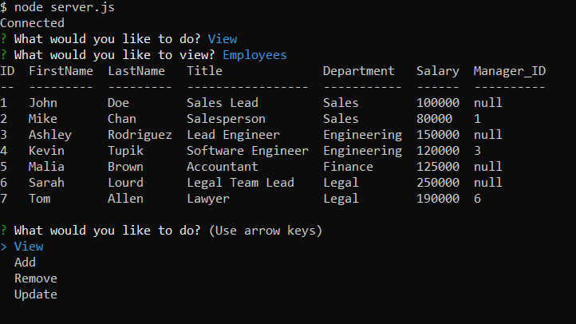

# EmployeeTracker

In this repository I created a content management system that allows the user to view and manipulate data of a business. The data includes information about employees, roles, and departments. The user is able to view, add, remove, and update this data based on input.

This application was built using Node, Inquirer, and MySQL.

